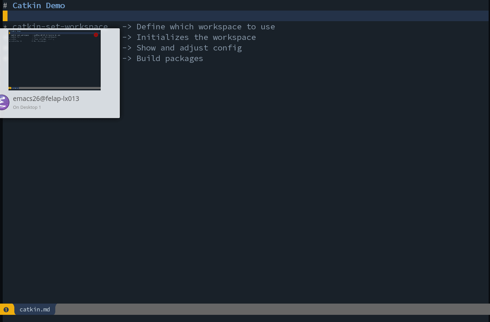

# Emacs Catkin Package
This package integrates the [catkin](http://wiki.ros.org/catkin) build tool for [ROS](http://ros.org) packages into Emacs. With it you can:

- Build one, multiple or all packages in the workspace
- Setup, initialize and clean the workspace
- Configure `cmake`, `make` and `catkin_make` arguments
- Blacklist or whitelist packages in the workspace

## Demo



## Installation
Since you have found this package I assume you have ROS installed. If you haven't already install catkin-tools:

```bash
sudo pip install catkin_tools
```

Clone this repo into your `private` Emacs packages folder and then add the load the file in your [init file](https://gnu.org/software/emacs/manual/html_node/emacs/Init-File.html#Init-File):

```bash
git clone https://github.com/gollth/helm-catkin.git ~/.emacs.d/private/helm-catkin
echo '(load-file ".emacs.d/private/helm-catkin/helm-catkin.el")' >> ~/.emacs
```

Spacemacs user can put the command in the `user-init` function of `.spacemacs`:

```lisp
(defun dotspacemacs/user-config ()

  ;; Helm-Catkin-Tools Package
  (load-file ".emacs.d/private/helm-catkin/helm-catkin.el")

  ;; ... other user config ...
  )
```

## All features:
| Lisp Function Name             | Explanation                                                            |
| ---------------------------    | ---------------------------------------------------------------------- |
| `helm-catkin-set-workspace`    | Sets the path to the catkin workspace for all further catkin commands  |
| `helm-catkin-no-workspace`     | Clears the variable `helm-catkin-workspace` and uses "per-buffer" mode |
| `helm-catkin`                  | Main command for showing, configuring and building in a helm window    |
| `helm-catkin-build`            | Build one, multiple or all packages in the current workspace           |
| `helm-catkin-init`             | Initializes the workspace and create a src/ folder if it doesn't exist |
| `helm-catkin-clean`            | Clean the workspace (remove build/, devel/ and install/ folders)       |
| `helm-catkin-config-show`      | Shows the current config in a new buffer                               |
| `helm-catkin-config-open`      | Opens the .catkin_tools/profiles/default/config.yaml file in a buffer  |
| `helm-catkin-set-devel-layout` | Sets the devel layout to linked, merged, or isolated.                  |

> **Hint**: Use `C-h f <function-name>` to get more information about parameters

## Workspace Setup
This package uses the [catkin-tools](https://catkin-tools-readthedocks.io/en/latest) python wrapper. The `catkin_make` and `catkin_make_isolated` commands are *NOT* supported.

Catkin relies on having a decicated workspace set to do anything. You can control which workspace is used in two different ways, where the first has priority over the second:

1. Set the `helm-catkin-workspace` variable to some path. This can be done e.g. interactively by calling `helm-catkin-set-workspace`.
2. Open a file inside the workspace. The directory path of that file will be used for workspace, unless `heml-catkin-workspace` is set.

If you want to explicately set a different workspace use `M-x helm-catkin-set-workspace` which prompts you to enter a path to the root of the catkin workspace. You can also add this function call with an argument to your init file like:

```lisp
(helm-catkin-set-workspace "~/path/to/your/catkin/ws")
```

To query the current workspace use `C-h v RET helm-catkin-workspace RET`.

## Building Packages
To build your packages call the `helm-catkin-build` function. This interactively prompts a [helm](https://emacs-helm.github.io/helm/) with two sections. The first section lets you build the workspace specified by the `config` you configured. The second **Packages** section list all packages in your workspace. Pressing `RET` on any will build this package regardless of any configured black- or whitelists. Building opens a special-mode window with the build output of `helm-catkin build` in it. You can close this window by pressing `q` when the build is done.

> **Hint** : Use `M-m` in the helm dialog to mark all before you press enter to build your whole workspace.

## Configuring the Workspace
The most general command is `helm-catkin`! This lists the current catkin config of the workspace in a helm dialog. The dialog is structured in sections. Each section contains list arguments which you can edit or remove. If in one section contains no arguments, the section is omitted. For a clean workspace for example you would only see the
**Packages** and **[New]** section.

### Sections

| Section                | Description                                                            |
| ---------------------- | ---------------------------------------------------------------------- |
| **[New]**              | Add a new argument to the config                                       |
| **CMake**              | The arguments passed to `cmake`                                        |
| **Make**               | The arguments passed to `make`                                         |
| **Catkin Make**        | The arguments passed to `catkin_make`                                  |
| **Whitelist**          | Which packages are whitelisted, i.e. are build exclusively             |
| **Blacklist**        | Which packages are blacklisted, i.e. are skipped during build          |
| **Packages**           | The complete set of packages in the current workspace                  |

### Actions
Each section has a distinct set of actions for each item. Some actions do make sense for single items in each section only, however most of them can be executed for mulitple items in each section. The first action [F1] is always the default choice if you just press enter. To see the actions press `C-z` in the helm query

### Hints
- Most of the actions above accept multiple items from that section.
- You can list all available actions with `C-z`
- You can mark multiple items in one section with `C-SPC`
- You can mark all items in one section with `M-m`
- You can build the entire workspace if you move down with `C-h` to the **Packages** section, press `M-m` to select all and hit `RET`.

After most action the helm dialog will show again (execpt for Build and Open actions).
To quit it just press ESC.")


## Shortcuts
Spacemacs users can use these sample shortcuts in their `.spacemacs` init file:

```lisp
(defun dotspacemacs/user-config ()

  ;; ... other user config ...

  ;; Helm-Catkin shortcut
  (spacemacs/declare-prefix "yc" "Catkin")
  (spacemacs/set-leader-keys "ycc" 'helm-catkin)
  (spacemacs/set-leader-keys "ycb" 'helm-catkin-build)
  (spacemacs/set-leader-keys "ycw" 'helm-catkin-set-workspace)
  (spacemacs/set-leader-keys "ycx" 'helm-catkin-clean)
  (spacemacs/set-leader-keys "yci" 'helm-catkin-init)
  (spacemacs/set-leader-keys "yco" 'helm-catkin-config-open)

)
```

Since you seem to be a ROS user you might find the [helm-ros](https://github.com/syohex/ro-helm) also interessting.

## Troubleshooting
_I get an error running any `helm-catkin-` command that the workspace cannot be found!_
> Follow the [Workspace Setup](#workspace-setup). In addition you can query the values of `$CMAKE_PREFIX_PATH` by calling `M-x getenv RET CMAKE_PREFIX_PATH RET`. Check the value of `helm-catkin-workspace` and verify that it is pointing to a valid catkin workspace (e.g. one with a `.catkin_tools` folder inside.) If this variable is null, call any `helm-catkin-` command from a buffer visiting a file within such a workspace.

_I need support for multiple catkin profiles!_
> Up to now only the default profile of any workspace is used. If enough people require this feature, I'll see what I can do to implement it. Up to then feel free to adjust the package and create a pull request.

_I need more help!_
> Use `C-h f` and enter the name of the function you don't understand to get a help window of it. In the `helm` dialogs check the help page by with `C-c ?`.
